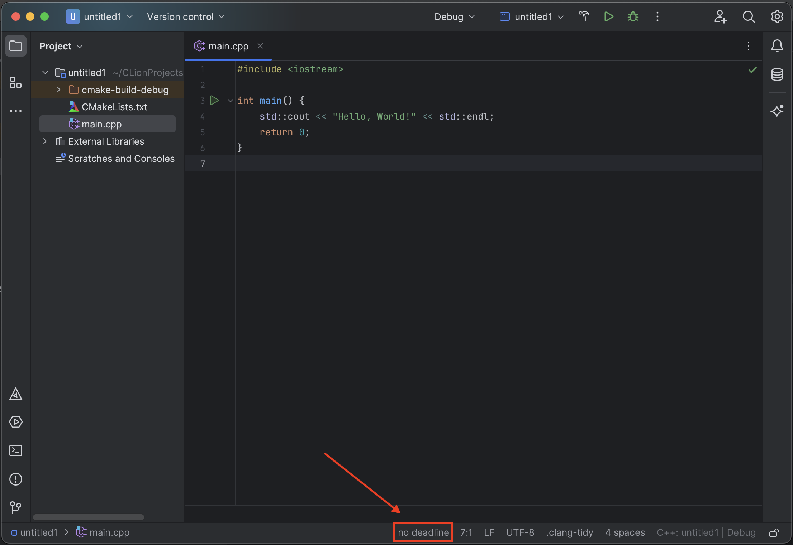
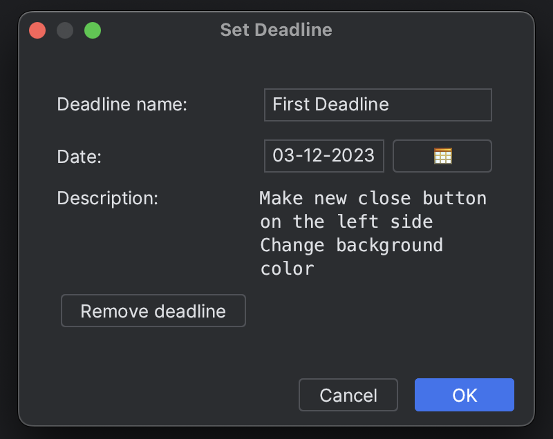

# Deadline Viewer

Clion Plugin

## Description

The plugin adds a reminder message about the deadline to the status bar. Deadline information includes the deadline
name, date, and description.

## Usage

Once installed the plugin, you will see a new status bar item located on the far left of the right status bar. By
default, it takes the value "no deadline".

If you click on this widget, a window will open to show/change the deadline.

Here you can see all the information about the current deadline, and also change it if necessary. In addition, by
clicking the "Remove deadline" button, information about the current deadline will be deleted and the bar status widget
will again display the message "no deadline"

All settings are saved after closing the project or ide.

## Change history

| Hash        | Message                               |
|-------------|---------------------------------------|
| **18f0429** | Initial commit                        |
| **d0a350c** | Create plugin                         |
| **8359d3c** | Replace plugin into status bar widget |
| **30b87db** | Add remove deadline button            |

## Author

Salnikov Danil Victorovich, M3108

**Enjoy!**
